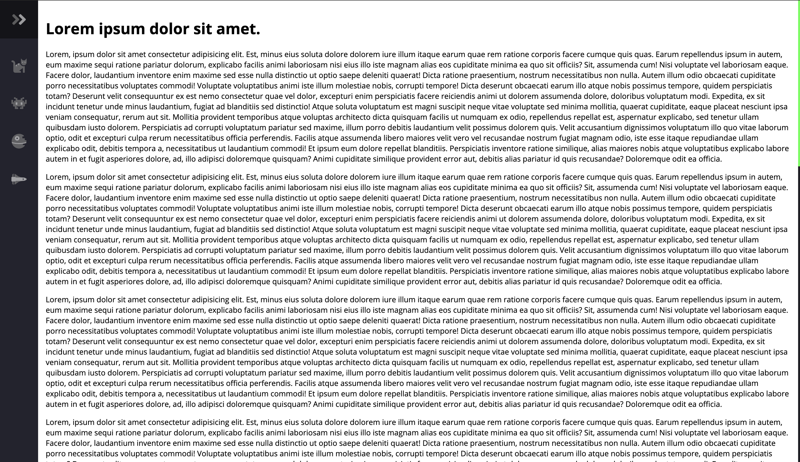
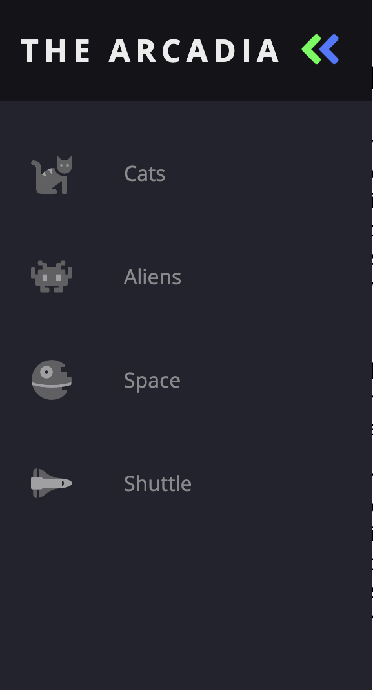
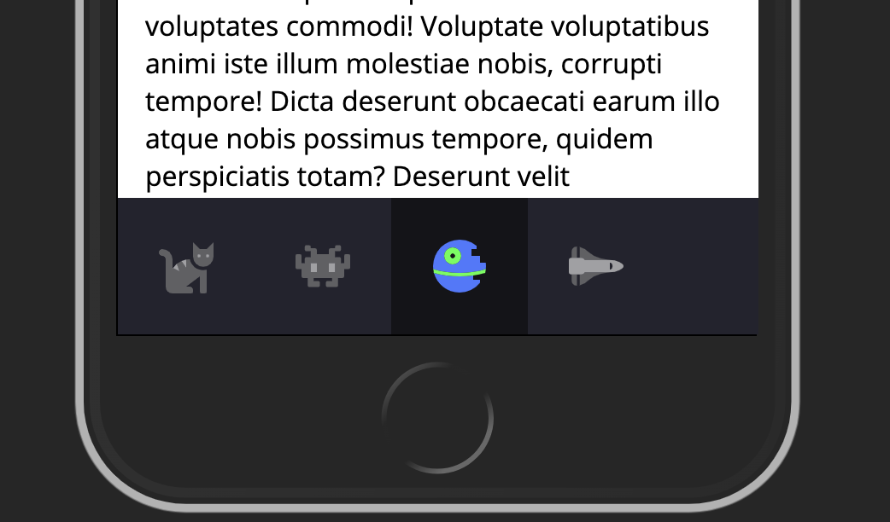

# Animated Navbar

Responsive navbar without any use of CSS frameworks

> Desktop menu closed

> Desktop menu open

> Mobile Menu (Fixed to the bottom)

## Contributing

> To get started...

### Step 1

- **Option 1**

  - 🍴 Fork this repo!

- **Option 2**
  - 👯 Clone this repo to your local machine using `https://github.com/scriptjumper/animated-navbar.git`

### Step 2

- **HACK AWAY!** 🔨🔨🔨

### Step 3

- 🔃 Create a new pull request using <a href="https://github.com/scriptjumper/animated-navbar/compare/" target="_blank">`https://github.com/scriptjumper/animated-navbar/compare/`</a>.

---
